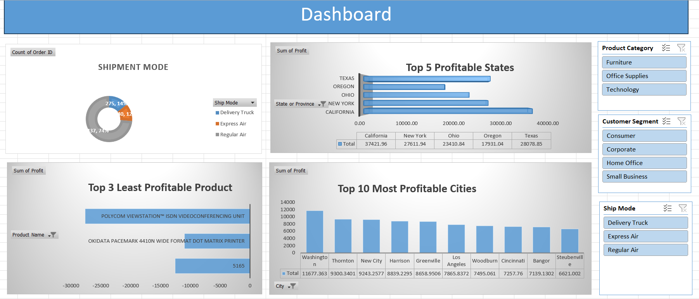

# Sales-Profit-Dashboard-Excel-

📊 Country Sales & Profit Analysis 

📌 Overview

This project presents an interactive Excel dashboard designed to analyze sales and profitability across regions, products, and customer segments. It provides clear insights into business performance using charts, slicers, and data visualization techniques.

🎯 Objectives

- Analyze overall sales and profit performance
- Identify top and least profitable products
- Understand regional and city-level profitability
- Evaluate customer segment performance
- Enable dynamic filtering using slicers

🔑 Key Metrics

- Total Profit
- Order Count
- Profit by State
- Profit by City
- Product-wise Profitability

📈 Dashboard Features

- Top 5 Profitable States bar chart
- Top 10 Most Profitable Cities visualization
- Top 3 Least Profitable Products analysis
- Shipment Mode Distribution (Donut Chart)
- Interactive slicers for:
- Product Category
- Customer Segment
- Ship Mode

🛠 Tools & Technologies Used

- Microsoft Excel
- Pivot Tables
- Pivot Charts
- Slicers
- Basic Formulas

📊 Insights

- A few states contribute majorly to total profit
- Some products consistently generate losses
- Key cities drive most of the revenue
- Customer segments vary in profitability
- Shipment modes influence order distribution

🚀 Outcome

Converted raw data into an interactive and visually appealing dashboard, enabling better understanding of business trends and supporting data-driven decisions.

